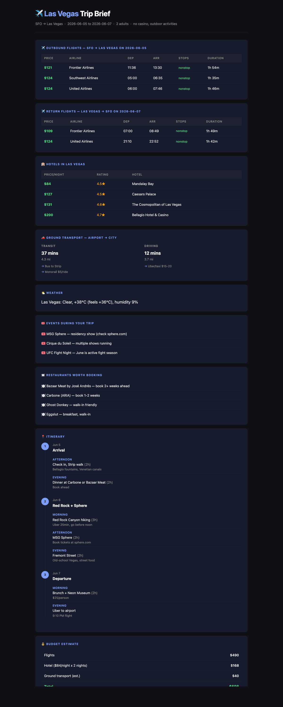

# ✈️ triply

**AI-powered travel brief generator.** One command gives you flights, hotels, ground transport, weather, travel advisory, local events, restaurant picks, and a day-by-day itinerary — pulled from live data, rendered in your terminal or exported as a clean HTML report.

```bash
python triply.py --from SFO --to LAS --depart 2026-06-05 --return 2026-06-07 --adults 2 --no-car --prefs "no casino"
```



---

## Features

- **Flights** — live prices from Google Flights (outbound + return)
- **Hotels** — real-time rates from Google Hotels
- **Ground transport** — transit and driving directions airport to city
- **Weather** — current conditions at destination
- **Travel advisory** — US State Dept safety level for international trips
- **Events** — what's happening at your destination during your dates
- **Restaurants** — top picks with booking lead times
- **Itinerary** — day-by-day schedule built around your arrival/departure
- **Budget** — total cost rollup across all components
- **HTML export** — clean dark-mode report you can save, share, or print

---

## Data Sources

| Section | Source | API Key Required |
|---|---|---|
| Flights | Google Flights via [fli](https://github.com/punitarani/fli) | None |
| Hotels | Google Hotels via [fast-hotels](https://github.com/jongan69/hotels) | None |
| Ground transport | Google Maps Directions API | Free ($200/mo credit) |
| Weather | [wttr.in](https://wttr.in) | None |
| Travel advisory | [US State Dept](https://travel.state.gov) | None |
| Events + restaurants | [Tavily Search](https://app.tavily.com) | Free tier |

Core features (flights, hotels, weather, advisory) work with **zero API keys**.

---

## Prerequisites

- Python 3.10+
- [fli](https://github.com/punitarani/fli) for flight search: `pipx install flights`
- [mcporter](https://github.com/openclaw/mcporter) for MCP tool routing

---

## Setup

```bash
# Clone the repo
git clone https://github.com/a692570/triply
cd triply

# Install Python dependencies
pip install -r requirements.txt

# Set up environment (optional — only needed for Maps + Tavily)
cp .env.example .env
# Edit .env and fill in your API keys
```

---

## Usage

```bash
# Weekend trip, no car
python triply.py --from SFO --to LAS \
  --depart 2026-06-05 --return 2026-06-07 \
  --adults 2 --no-car --prefs "no casino, outdoor activities"

# Week-long international trip
python triply.py --from SFO --to CUN \
  --depart 2026-06-15 --return 2026-06-22 \
  --adults 3 --prefs "outdoor activities, cenotes"

# Export to HTML report
python triply.py --from JFK --to LHR \
  --depart 2026-07-10 --return 2026-07-17 \
  --adults 1 --html london-trip.html

# With budget tracking
python triply.py --from SFO --to NRT \
  --depart 2026-08-01 --return 2026-08-10 \
  --adults 2 --budget 3000
```

### All flags

| Flag | Description | Default |
|---|---|---|
| `--from` | Origin city or IATA code | required |
| `--to` | Destination city or IATA code | required |
| `--depart` | Departure date (YYYY-MM-DD) | required |
| `--return` | Return date (YYYY-MM-DD) | required |
| `--adults` | Number of adults | 1 |
| `--no-car` | No rental car — plan around transit/Uber | false |
| `--prefs` | Freeform preferences/exclusions | "" |
| `--budget` | Total budget in USD | none |
| `--html` | Export HTML report to this path | none |

---

## Getting API Keys

**Google Maps** (ground transport):
1. Go to [console.cloud.google.com](https://console.cloud.google.com/apis/credentials)
2. Create an API key, enable Directions API + Geocoding API
3. Add to `.env` as `GOOGLE_MAPS_API_KEY`
4. Free $200/month credit — well beyond personal use limits

**Tavily** (events + restaurants):
1. Sign up at [app.tavily.com](https://app.tavily.com)
2. Copy your API key
3. Add to `.env` as `TAVILY_API_KEY`
4. Free tier: 1,000 searches/month

---

## Examples

See [`examples/`](examples/) for full sample outputs:
- [`vegas_weekend.md`](examples/vegas_weekend.md) — SFO to Las Vegas, weekend trip, no car
- [`tulum_week.md`](examples/tulum_week.md) — SFO to Tulum via Cancun, week-long trip

---

## Contributing

PRs welcome. Ideas:

- Destination-specific itinerary suggestions (beyond generic placeholders)
- Return flight timing logic (back-calculate from commitments)
- More hotel/flight data sources
- Booking link integration
- Cached results to avoid repeated API calls

---

## License

MIT
